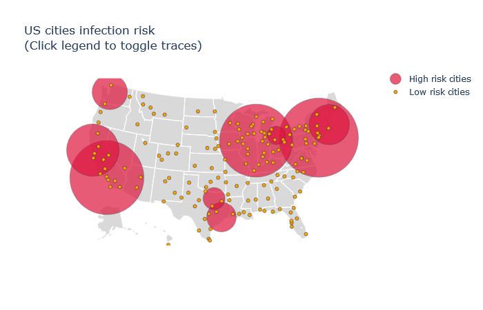

# wuhan_coronavirus_risk
This is a project created for Rice Datathon 2020. We (Daniyar Akizhanov '23, Austin Hushower '23) analyzed data from different sources to measure the relative risk of coronavirus spreading in different US cities. We used the flights data from Yandex Timetables and coronavirus data from JHU to create a network model and identified the US cities with the highest risks. The following map presents our findings:

